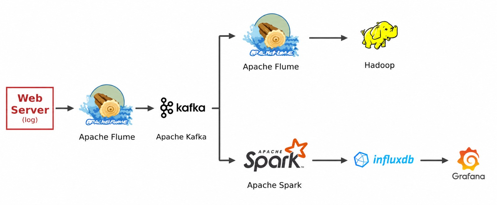

# Real-Time Weather Data Pipeline

## Overview

This project implements a real-time weather data pipeline that collects weather information from Weather API for multiple cities.

The pipeline extracts weather data using Python, stores the collected data as JSON records, then processes the streaming data using Apache Flume, Kafka, and Spark before storing and visualizing the results.

---

## Architecture Diagram

---

## Data Flow

1. Weather API provides real-time weather data for multiple cities.

2. Python script collects data from the API and stores the extracted records in JSON format.

3. Apache Flume collects the JSON data and transfers it to Apache Kafka.

4. Apache Kafka acts as a message broker to handle real-time data streaming.

5. Data is processed through two paths:

   - Flume → Kafka → HDFS  
     for distributed storage and historical analysis.

   - Kafka → Spark Streaming → InfluxDB → Grafana  
     for real-time processing, monitoring, and visualization.

6. Grafana displays real-time weather metrics and dashboards.

---

# Technologies Used

| Technology | Purpose |
|------------|---------|
| Weather API | Real-time weather data source |
| Python | API data extraction and JSON generation |
| Apache Flume | Data ingestion and transfer |
| Apache Kafka | Real-time message streaming |
| Apache Spark Streaming | Real-time data processing |
| Hadoop HDFS | Distributed storage |
| InfluxDB | Time-series database |
| Grafana | Data visualization |

---

# Pipeline Components

## 1. Weather API + Python

Used to collect weather data from different cities and generate structured JSON records.

Responsibilities:
- API communication
- Data extraction
- JSON generation

## 2. Apache Flume

Used to collect JSON weather data and transfer it to Kafka.

Responsibilities:
- Data ingestion
- Data transfer

## 3. Apache Kafka

Acts as a real-time streaming platform between data producers and consumers.

Responsibilities:
- Message buffering
- Real-time data streaming

## 4. Apache Spark Streaming

Processes incoming weather data from Kafka.

Operations:
- Data processing
- Transformation
- Real-time analytics

## 5. Hadoop HDFS

Stores processed weather data in a distributed environment.

## 6. InfluxDB + Grafana

Used for monitoring and visualization.

Grafana dashboards display:
- Temperature metrics
- Humidity
- Wind speed
- Real-time weather monitoring
